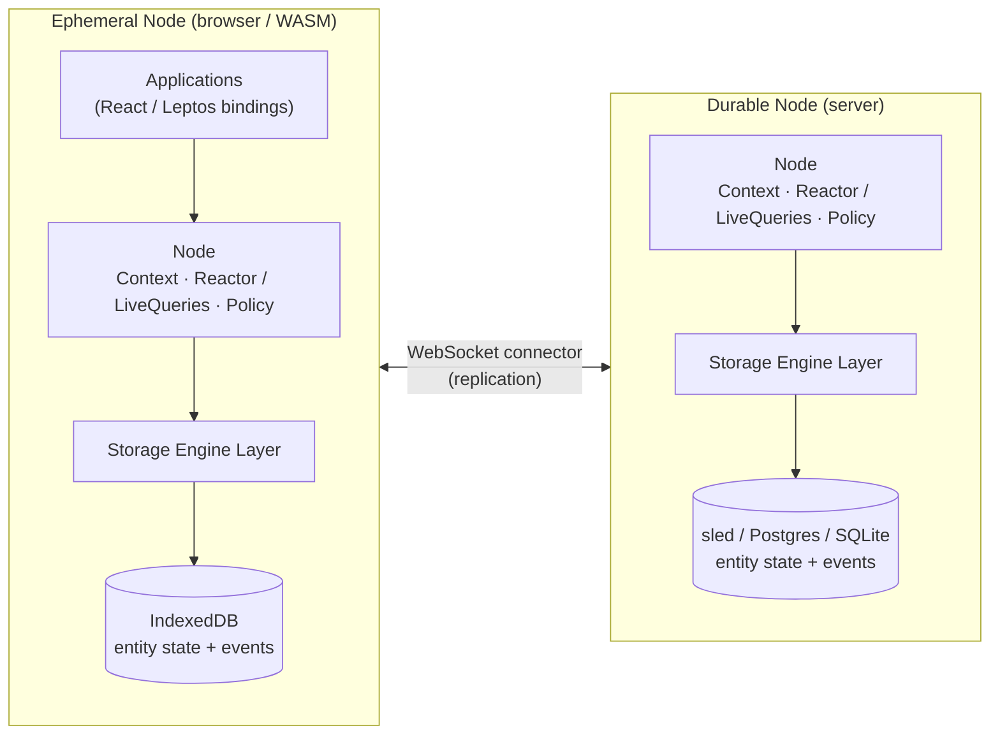

# How Ankurah Works

One screen, whole system: Ankurah is a distributed, event-sourced state
framework. Applications talk to a local **Node**; nodes persist entity
state and immutable events through pluggable storage engines and
synchronize with each other over connectors. Everything else in this book
hangs off this map.

The client (ephemeral) node holds a cache in the browser, while the durable node
is the source of truth on the server. Both run the same `Node` core -- a
`Context` for scoped access, a `Reactor` driving live queries, and a policy
agent -- and both persist entity state snapshots alongside the immutable events
behind them through the storage engine layer. Ephemeral and durable nodes
synchronize over a WebSocket connector.

## The pieces

**Node** -- the fundamental unit. Every process embeds one: it holds entity
state, evaluates queries, runs policy, and replicates with peers. Durable
nodes (servers) keep the full event history; ephemeral nodes (browsers)
hold a synchronized working set and fetch history on demand. Details:
[Node Architecture and Replication](internals/node-architecture.md).

**Events and the DAG** -- every change is an immutable event whose id is a
content hash of the event and its parent references. Per entity, events
form a DAG like a git history; the entity's current state points at the
DAG's head, and concurrent branches merge deterministically, field by
field. Narrative: [How Ankurah Handles Concurrency](concurrency/index.md);
contract: [Conflict Resolution & Guarantees](concurrency/guarantees.md).

**Live queries and reactivity** -- applications read through one-shot
`fetch()` or subscribe with `query()`, which returns a `LiveQuery` that
updates as matching entities change anywhere in the system. A reactor per
node matches committed changes against active subscriptions and drives the
signal graph your UI observes. Usage: [Querying Data](queries/index.md)
and [React Bindings](reactivity/react.md).

**Storage engines** -- every node writes through a pluggable storage
engine that persists two things per collection: entity state snapshots
(the materialized current view) and the immutable events behind them. The
same two traits back Sled, Postgres, SQLite, and browser IndexedDB, with
shared query-planning machinery so each engine implements placement and
I/O rather than reinventing predicate handling. Details:
[Storage Engine Layer](internals/storage-engines.md).

**Connectors** -- nodes synchronize over WebSocket connectors today
(server and native/WASM clients), carrying subscriptions, deltas, and
event batches. Direct peer-to-peer connections and end-to-end encryption
are roadmap items -- see [Design Goals](design-goals.md).

## The write path, end to end

A local commit generates events, applies them to local state, and persists
them; the reactor matches the change against active subscriptions; matching
peers receive the events and apply them through exactly the same
integration path as local writes. One code path, local or remote -- that
symmetry is what makes offline writes, re-deliveries, and concurrent edits
all resolve uniformly. The full trace lives in
[The Compare-Apply Cycle](internals/compare-apply-cycle.md).

## Consistency Model

Ankurah uses **eventual consistency** with strong guarantees:

- Operations are **causally consistent**: if event B depends on event A, all nodes see A before B
- Conflicts are resolved deterministically using operation IDs
- Nodes can operate while partitioned and sync when reconnected

## Learn More

- See the [Design Goals](design-goals.md) for the philosophy behind these choices
- Check out [Examples](examples.md) for practical code demonstrating these concepts
- Join the [Discord](https://discord.gg/XMUUxsbT5S) to discuss architecture and implementation details
