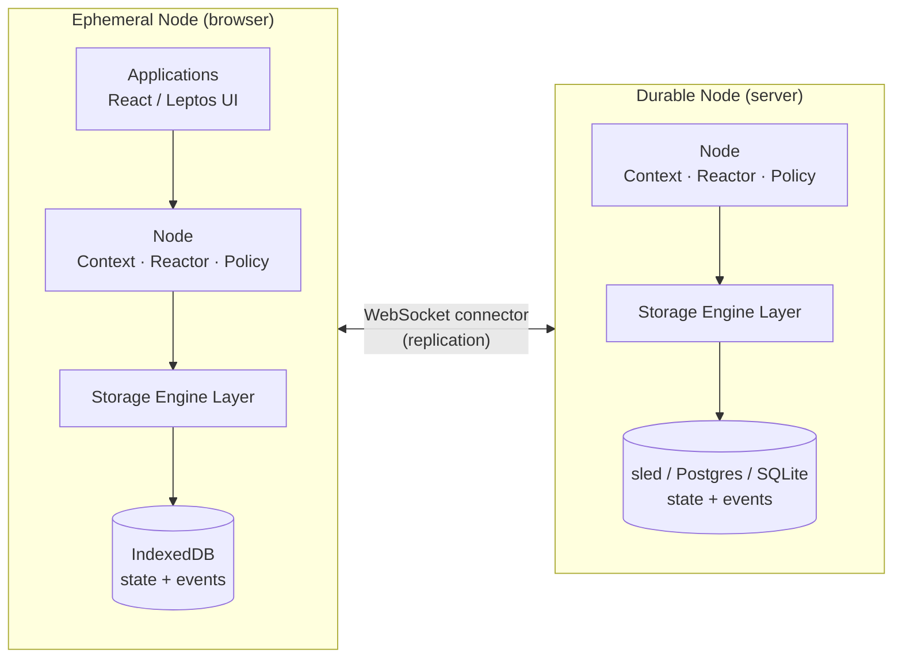

# How Ankurah Works

Ankurah is a distributed, event-sourced state framework. Applications talk to
a local **Node**; nodes persist entity state and immutable events through
pluggable storage engines and synchronize with each other over connectors.
The diagram shows the current, well-exercised topology: many ephemeral clients
connected to one durable server.

The client (ephemeral) node holds a working set in the browser, while the
durable server retains complete history. **Durable** and **ephemeral** describe
history-retention roles rather than fixed client/server identities, but 0.9's
supported deployment shape still uses one durable node per system; the
multi-durable plumbing is not yet a tested deployment contract. Broader
multi-durable deployment support is coming soon; schema-registration
propagation is one concrete blocker tracked in
[ankurah/ankurah#309](https://github.com/ankurah/ankurah/issues/309). Both run
the same `Node` core -- a
`Context` for scoped access, a `Reactor` driving live queries, and a policy
agent -- and both use the same state/event storage interfaces. A snapshot
payload may populate an ephemeral working set without storing all of the head
events behind that state. Ephemeral and durable nodes synchronize over a
WebSocket connector.

## The pieces

**Node** -- the fundamental unit. A participating application embeds one or
more Nodes; each holds entity
state, evaluates queries, runs policy, and replicates with peers. Durable
nodes (commonly servers) keep the full event history; ephemeral nodes (commonly browsers)
hold a synchronized working set and fetch history on demand. Details:
[Node Architecture and Replication](internals/node-architecture.md).

**Events and the DAG** -- every change is an immutable event whose id hashes
the entity ID, operation set, and parent clock. Per entity, events
form a DAG like a git history; the entity's current state points at the
DAG's head, and concurrent branches merge deterministically, field by
field. Narrative: [How Ankurah Handles Concurrency](concurrency/index.md);
contract: [Conflict Resolution & Guarantees](concurrency/guarantees.md).

**Live queries and reactivity** -- applications read through one-shot
`fetch()` or subscribe with `query()`, which returns a `LiveQuery` that
updates as matching changes are delivered to the node. A reactor per
node matches applied changes against active subscriptions and drives the
signal graph your UI observes. Usage: [Querying Data](queries/index.md)
and [React Bindings](reactivity/react.md).

**Storage engines** -- every node writes through a pluggable storage
engine that can persist entity state snapshots (the materialized current
view) and retained immutable event history per collection. Durable nodes keep
the history; an ephemeral snapshot can exist without all of its head events. The
same two traits back Sled, Postgres, SQLite, and browser IndexedDB. Sled and
IndexedDB use the common planner; the SQL engines use backend-specific query
builders and predicate pushdown while preserving the shared public API. Details:
[Storage Engine Layer](internals/storage-engines.md).

**Connectors** -- released nodes synchronize over WebSocket connectors today
(server and native/WASM clients), carrying subscriptions, deltas, and event
batches. An Iroh peer-to-peer connector is under active development
([#341](https://github.com/ankurah/ankurah/pull/341)) and is not part of the
released connector set yet. End-to-end encryption remains a
separate roadmap concern -- see [Design Goals](design-goals.md).

## The write path, end to end

A local commit validates a transaction, generates and persists its events,
relays them to required peers, then applies and persists canonical local state
before notifying the reactor. Remote payloads enter through `NodeApplier`,
which stages and orders their events before using the
same causal comparison and property-backend merge semantics. The orchestration
paths differ, but both converge on the same event-DAG rules. The full trace lives in
[The Compare-Apply Cycle](internals/compare-apply-cycle.md).

## Consistency Model

Given eventual delivery of the same event histories, nodes converge with
strong per-entity guarantees: event-bearing updates are ordered parents before
children, validated state snapshots may install cumulative state directly, and
per-field conflict resolution is deterministic. Nodes can keep writing locally
while disconnected, but 0.9's WebSocket connector does not yet maintain an
outbox or automatically replay disconnected writes on reconnect; the histories
must be delivered by application or future connector machinery. Reliable
failed/disconnected-write delivery is tracked in
[ankurah/ankurah#195](https://github.com/ankurah/ankurah/issues/195), with
broader anti-entropy work in
[ankurah/ankurah#115](https://github.com/ankurah/ankurah/issues/115). The
precise promises and non-promises are in
[Conflict Resolution & Guarantees](concurrency/guarantees.md).

## Learn More

- See the [Design Goals](design-goals.md) for the philosophy behind these choices
- Check out [Examples](examples.md) for practical code demonstrating these concepts
- Join the [Discord](https://discord.gg/XMUUxsbT5S) to discuss architecture and implementation details
